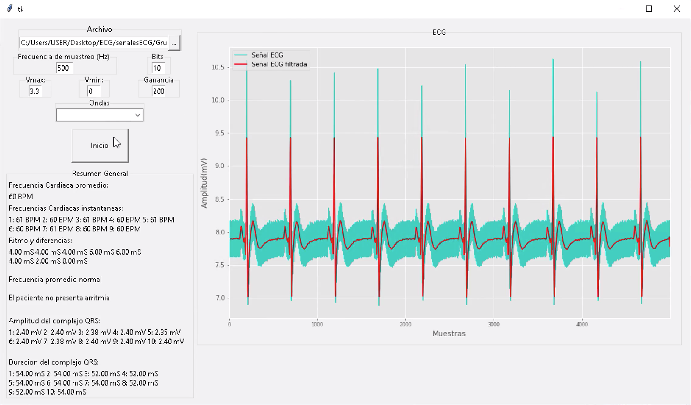

# Aplicación para extración de características ECG

Esta es una aplicación para determinar diferentes carácteristicas de las ondas del corazón. El archivo principal es 'Algoritmo.py' y los recursos de las ondas se encuentran en la carpeta senalesECG

## Vista general

## Demostración

